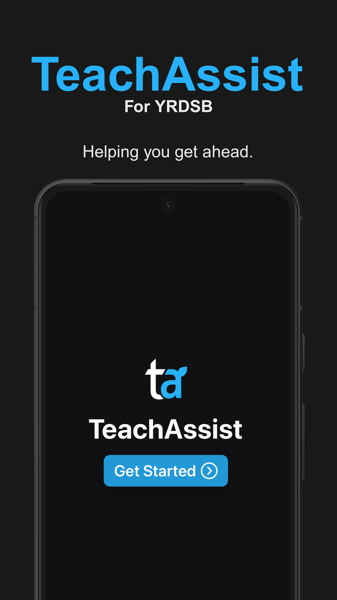
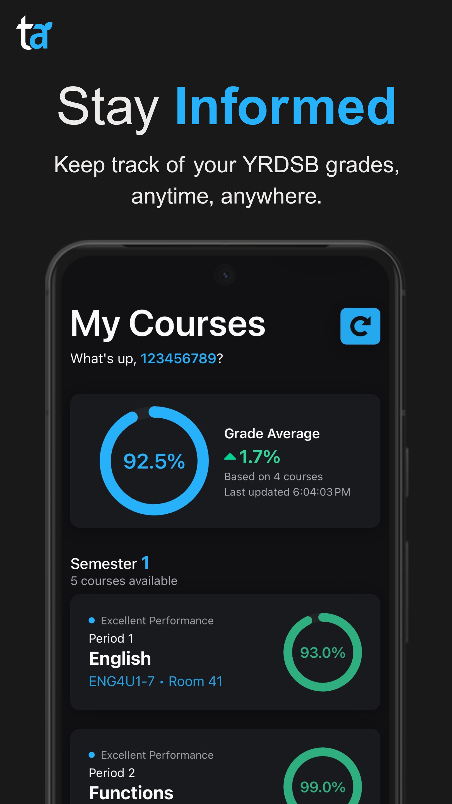
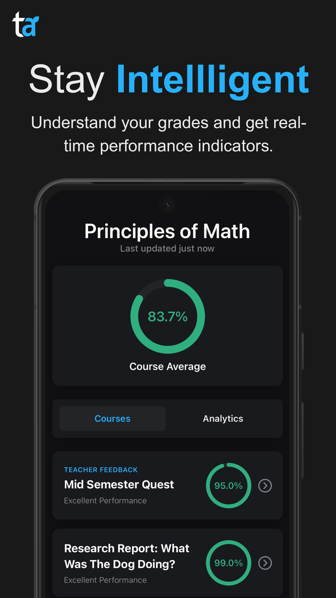
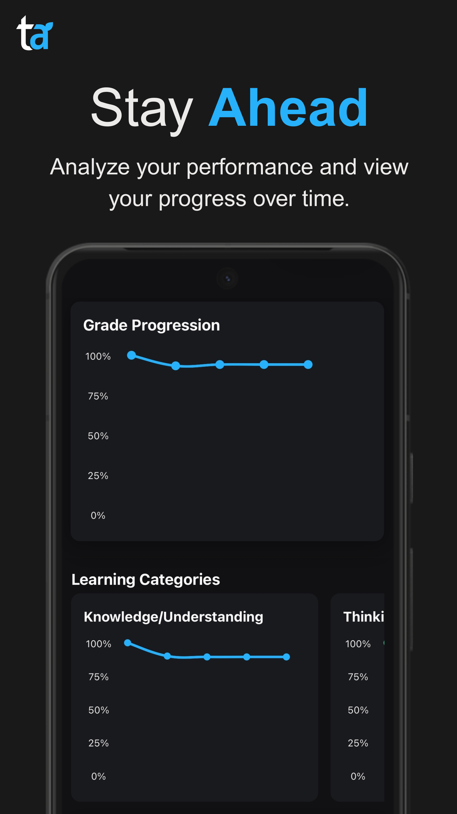
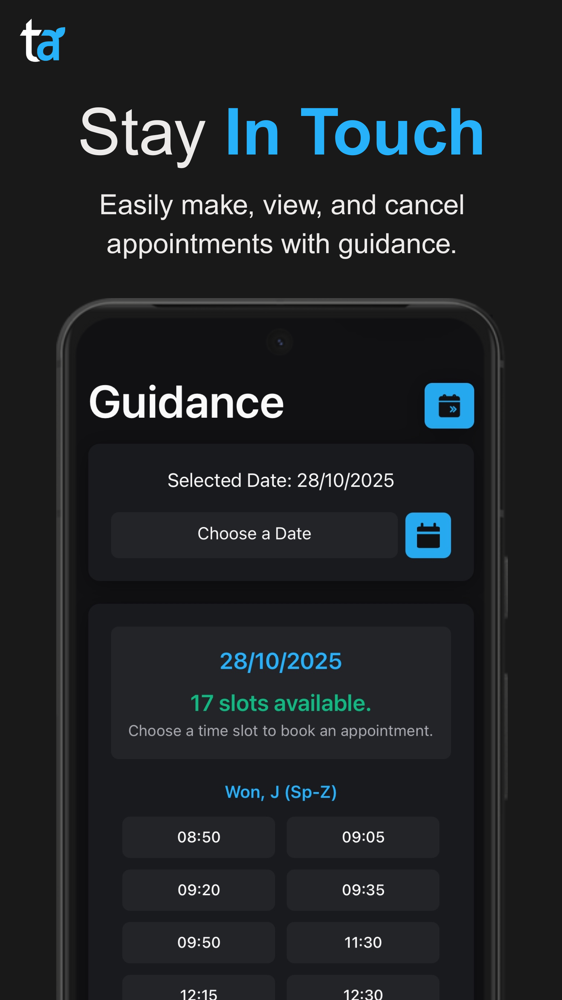
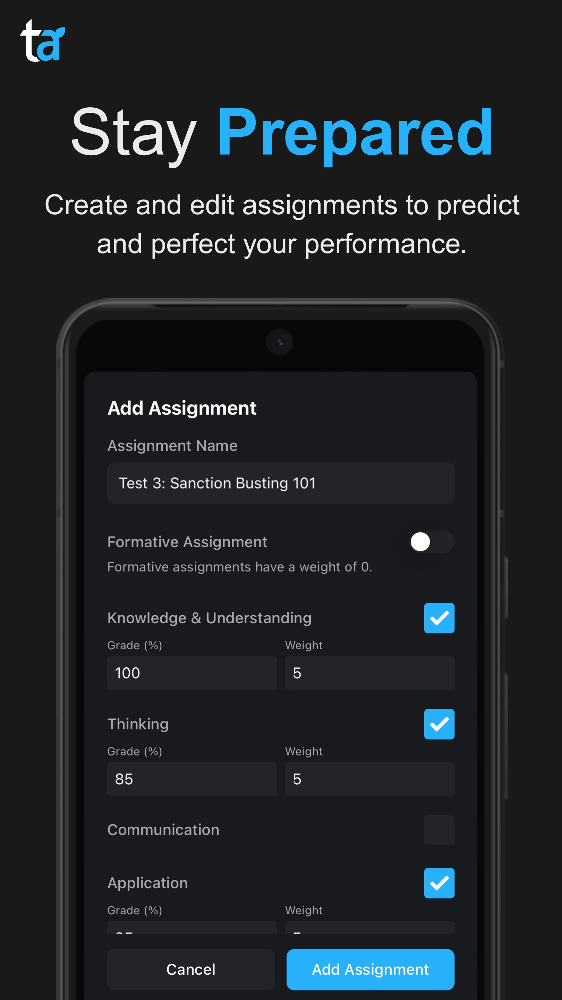
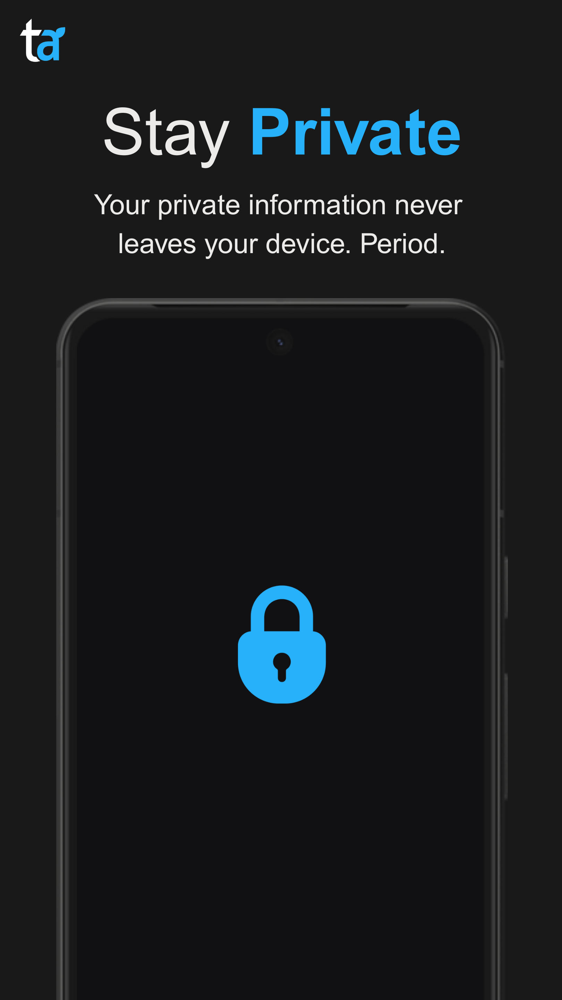
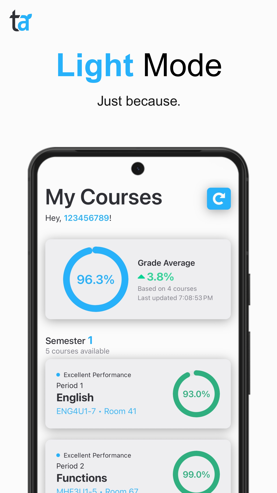

<p align="center">
 
 <h1 align="center">TeachAssist: Check Your Grades</h1>
 <p align="center">An unofficial mobile app for the YRDSB TeachAssist portal.</p>
 <p align="center" style="font-weight: bold">Not affiliated with YRDSB or The TeachAssist Foundation!</p>
 <div align="center">
   <a href="https://play.google.com/store/apps/details?id=com.prmntr.teachassist">
     
   </a>
 </div>
 <div style="padding-top: 10px;"> 
   <p align="center">
    <a href="https://play.google.com/store/apps/details?id=com.prmntr.teachassist">Download</a>
    ·
    <a href="https://prmntr.com/teachassist">Website</a>
    ·
    <a href="https://forms.gle/BECBr8LqgtnzzHqS6">Report Bug</a>
    ·
    <a href="https://github.com//prmntr/teachassist/issues/new?assignees=&labels=enhancement&projects=&template=feature_request.yml">Request Feature</a>
    ·
    <a href="https://prmntr.com/teachassist/privacy">Privacy Policy</a>
  </p>
 </div>
</p>

## Overview [](https://deepwiki.com/prmntr/teachassist)

TeachAssist provides students with an open source streamlined mobile experience to access their academic information from the York Region District School Board's TeachAssist portal (ta.yrdsb.ca). View your grades, track performance over time, and get assignment feedback - all in a clean, native mobile interface.
## Features

### Current Features
- 📊 **Grade Tracking** - View current marks and performance across all classes
- 📅 **Appointment Booking** - Book, view, and cancel guidance appointments directly from the app
- 🔔 **Notifications** - Get notified when your marks change and guidance appointments
- 📈 **Trend Analysis** - Track your progress over time with detailed analytics
- 🔮 **Performance Prediction** - Add and edit assignments to forecast course performance
- 📝 **Assignment Feedback** - Access teacher feedback on individual assignments
- 📱 **Mobile-Optimized Interface** - Clean, intuitive design built specifically for mobile devices
- 🔐 **Privacy Features** - End-to-end encryption with YRDSB credentials, plus options to restrict and lock who sees your grades
- ⚡ **Fast Performance** - Quick access to your academic data

### Coming Soon
- ⏹️ **Widgets** - See your marks at a glance without ever opening the app
- 🧑‍💻 **API** - Interface with the TeachAssist website through code
- 🍎 **iOS Support** - Support for Apple devices

## Screenshots

<div class="flex items-center justify-center">








</div>

## Privacy & Security

- **No Data Storage**: Your credentials and academic data stay private between you, your device, and TeachAssist
- **Direct Connection**: The app connects directly to the official YRDSB TeachAssist portal
- **Local Processing**: All data processing happens locally on your device
- **Secure Authentication**: Securely authenticates with the YRDSB portal

## Installation

### For Users
- **Android: [Play Store](https://play.google.com/store/apps/details?id=com.prmntr.teachassist)**
- **Web: [TeachAssist](https://prmntr.com/teachassist)**
- **iOS: [Coming Soon](/)**

### For Developers

#### Prerequisites
- Node.js (v16 or higher)
- npm or yarn
- Expo CLI
- iOS Simulator (for iOS development), Android Studio (for Android development), or an iOS or Android device

#### Setup
1. Clone the repository:
   ```bash
   git clone https://github.com/prmntr/teachassist.git
   cd teachassist
   ```

2. Install dependencies:
   ```bash
   npm install
   # or
   yarn install
   ```

3. Start the development server:
   ```bash
   npx expo start
   ```

4. Run on your preferred platform:
   - **iOS**: Press `i` in the terminal or scan the QR code with your iPhone camera
   - **Android**: Press `a` in the terminal or scan the QR code with the Expo Go app

## Tech Stack

- **Framework**: React Native
- **Platform**: Expo
- **Language**: JavaScript/TypeScript
- **Authentication**: Secure credential handling for YRDSB portal
- **API Integration**: Custom wrapper for ta.yrdsb.ca

## Contributing

Contributions are welcomed. Here's how you can help:

1. **Fork the repository**
2. **Create a feature branch**: `git checkout -b feature/amazing-feature`
3. **Make your changes**: Implement your feature or fix
4. **Test thoroughly**: Ensure your changes work as expected
5. **Commit your changes**: `git commit -m 'Add amazing feature'`
6. **Push to the branch**: `git push origin feature/amazing-feature`
7. **Open a Pull Request**: Describe your changes and their benefits

## Support

If you encounter any issues or have questions:
- 🐛 **Bug Reports**: Open an issue on GitHub
- 💡 **Feature Requests**: Submit an issue with the "enhancement" label
- 📧 **Contact**: [Google Forms](https://forms.gle/BECBr8LqgtnzzHqS6)

## Disclaimer

**This app is an unofficial mobile client for the YRDSB TeachAssist portal. It is not affiliated with, endorsed by, or officially connected to the York Region District School Board or The TeachAssist Foundation. All academic data is retrieved directly from the official ta.yrdsb.ca portal. I am not responsible for any information displayed on the app. USE THIS APP AT YOUR OWN RISK!**

## License

This project is licensed under the MIT License - see the [LICENCE](LICENCE) file for details.

---

**Made with ☕,📜 & 🧋**
